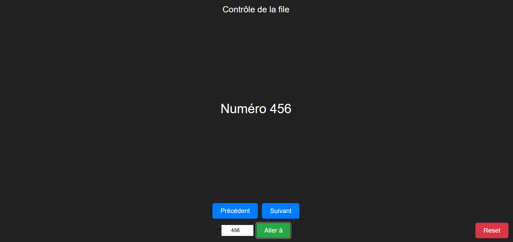

# 🎟️ Système de File d’Attente (WebSocket + Node.js)

Un petit projet de gestion de file d’attente en **temps réel**.

- Plusieurs agents se connectent sur une page **Admin** pour faire défiler les numéros.
- Une TV (ou un autre écran) affiche le numéro courant et l’annonce avec une **voix de synthèse**.
- Tout est synchronisé en direct grâce aux **WebSockets**.

---

## 🚀 Fonctionnalités

- Boutons **Suivant**, **Précédent**, **Reset** pour gérer le compteur.
- Champ **Aller à** pour forcer un numéro précis (ex : si on reprend à partir d’un ticket papier).
- Affichage **clair et lisible** sur la TV (fond blanc, texte rouge géant).
- **Annonce vocale** automatique avec bip sonore avant le numéro.
- Fonctionne sur plusieurs appareils (PC, smartphones, TV connectée) en même temps.

---

## 🖥️ Interfaces

### Page Admin

Permet aux agents de contrôler le numéro affiché.



### Page Display

Affiche le numéro actuel en grand sur la TV et l’annonce à voix haute.


---

## 📂 Structure du projet

```text
QUEUE/
├─ public/
│  ├─ admin.html        # interface agent (Suivant/Précédent/Reset/Aller à)
│  ├─ display.html      # affichage TV (bip + voix)
│  ├─ bip.mp3           # bip court joué avant l’annonce
│  ├─ admin.png         # capture admin (pour ce README)
│  └─ display.png       # capture display (pour ce README)
├─ server.js            # serveur HTTP + WebSocket
├─ package.json         # scripts npm (start) + deps
├─ package-lock.json
└─ .gitignore
```

---

## 🧪 Installation & test en local

1. **Installer les dépendances**

   ```bash
   npm install
   ```

2. **Lancer le serveur**

   ```bash
   npm start
   ```

   3. **Ouvrir les pages**

   - Admin → [http://localhost:3000/admin.html](http://localhost:3000/admin.html)
   - Display → [http://localhost:3000/display.html](http://localhost:3000/display.html)

> 💡 Astuce : depuis d’autres appareils du même réseau (PC, TV, smartphone), remplace `localhost` par l’adresse IP locale de ta machine (exemple : `http://192.168.1.25:3000/display.html`).

---

## 🌍 Déploiement en ligne (Render)

1. Pousser le projet dans un **repo GitHub**.
2. Aller sur [https://render.com](https://render.com) → **New → Web Service**.
3. Paramétrer :
   - Runtime : `Node`
   - Build command : `npm install`
   - Start command : `npm start`
4. Render génère une URL publique, par exemple :

<pre> https://queue-system.onrender.com  </pre>

URLs finales

Admin → <pre>https://queue-system.onrender.com/admin.html</pre>

Display → <pre>https://queue-system.onrender.com/display.html</pre>

## 🗣️ Réglages de la voix

La page **Display** utilise l’API `SpeechSynthesis`.  
Tu peux modifier la voix, le volume ou la vitesse dans `display.html` :

```js
msg.volume = 1; // Volume (0.0 à 1.0)
msg.rate   = 1; // Vitesse
msg.pitch  = 1; // Tonalité


Lister toutes les voix disponibles :

speechSynthesis.getVoices().forEach(v => console.log(v.name, v.lang));
```

Exemple pour forcer une voix masculine (Microsoft Paul) :

```js
const voices = speechSynthesis.getVoices();
const paul = voices.find((v) => v.name.includes("Microsoft Paul"));
if (paul) msg.voice = paul;
```

Lister toutes les voix disponibles :

```js
speechSynthesis.getVoices().forEach((v) => console.log(v.name, v.lang));
```

## 🧱 .gitignore conseillé

```js
# Node
node_modules/
npm-debug.log
yarn-error.log

# Logs
logs
*.log
*.log.*

# OS
.DS_Store
Thumbs.db

# Archives
*.zip
*.tar
*.tar.gz

# Env
.env
```

## 🔒 Notes d’usage

Le compteur est en mémoire → il se réinitialise si le serveur redémarre.

Tous les clients connectés (admin + display) sont synchronisés en direct via WebSocket.

Le bip sonore est joué avant chaque annonce.

La voix nécessite un clic initial sur “Activer la voix” (politique anti-autoplay des navigateurs).

## 📜 Licence

Projet libre, utilisable en contexte personnel ou professionnel.
Aucune garantie. Contributions bienvenues.
